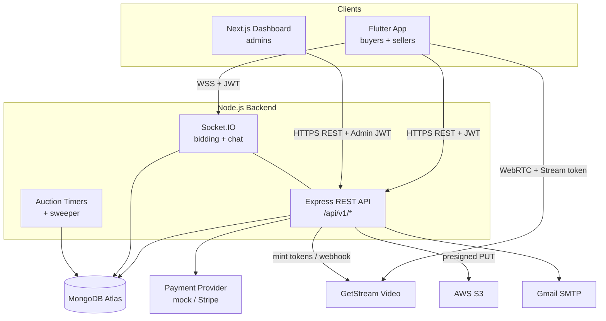
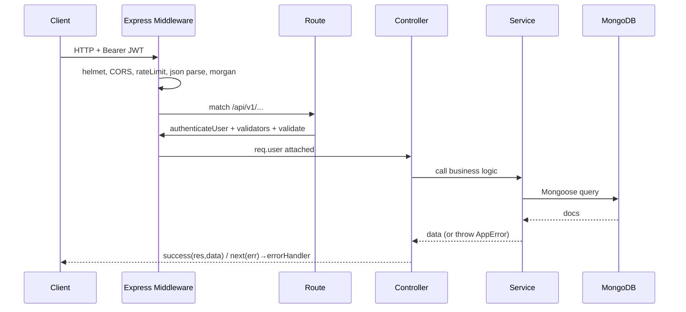
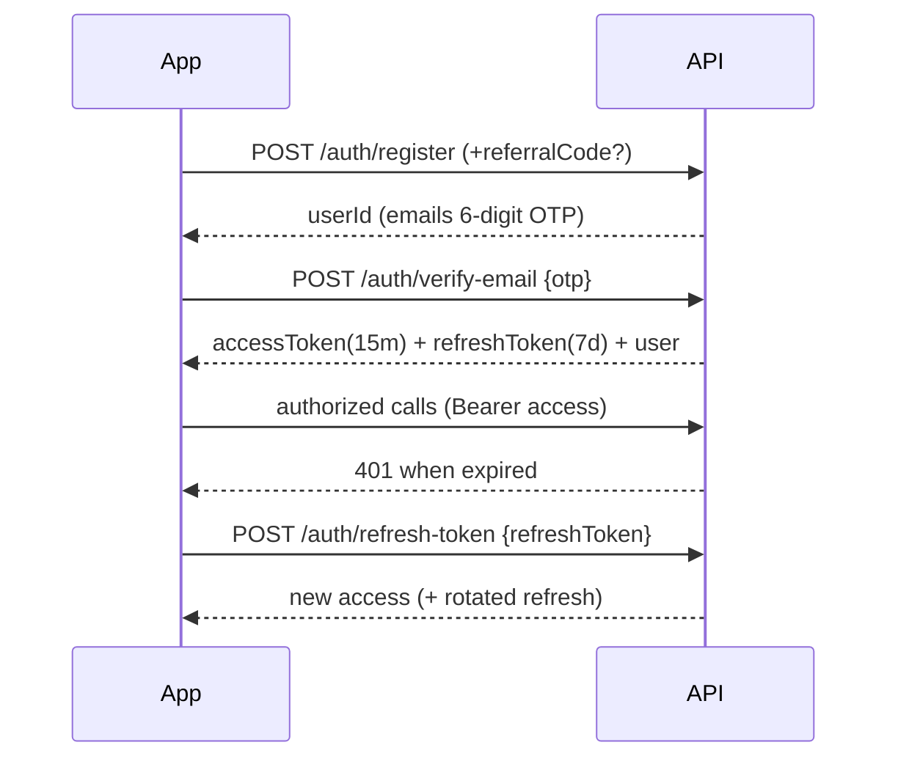
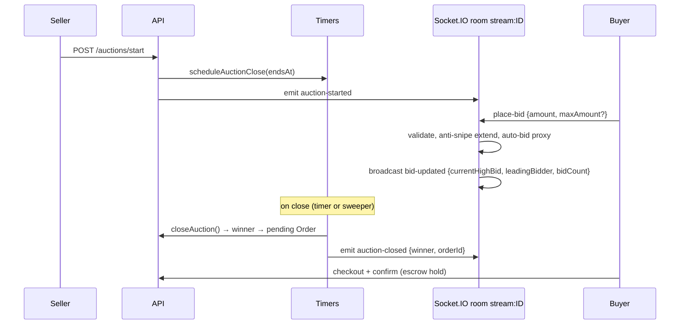
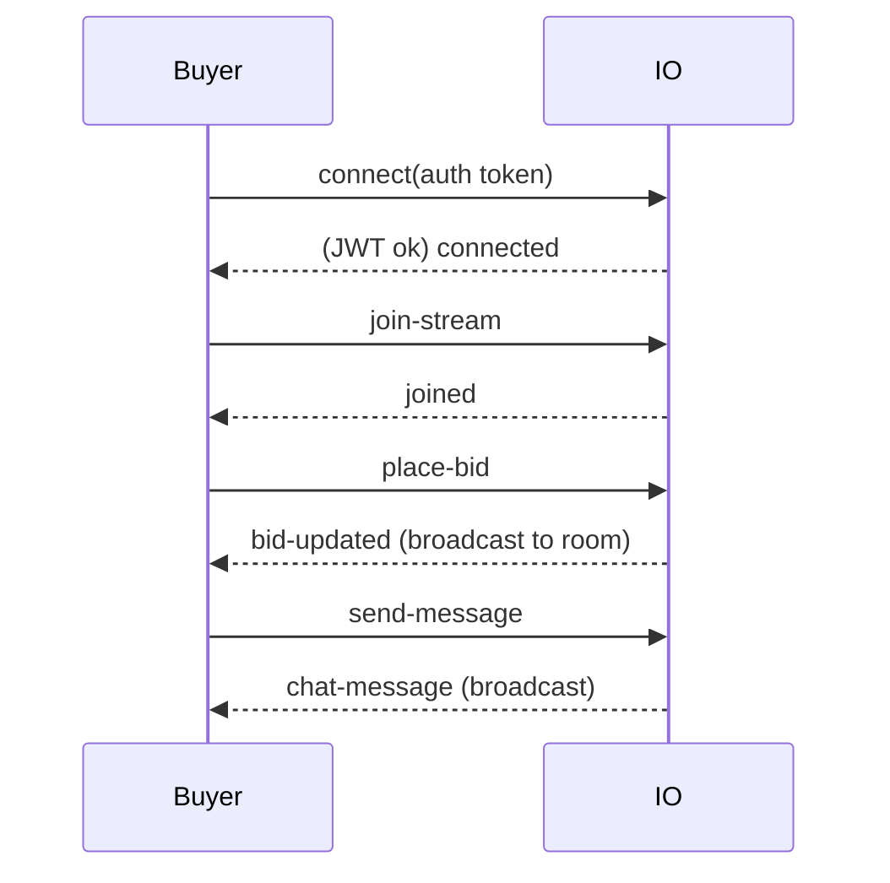

# BidsRush — Developer Handover Document (`devdoc.md`)

> Complete technical handover for a new engineering team. Read top-to-bottom before touching code.
> Companion docs: [`status.md`](./status.md) (feature audit), [`sellerflow.md`](./sellerflow.md), [`userflow.md`](./userflow.md).
> Last updated: 2026-07-13. Keep this file current when architecture changes.

---

## Table of Contents
1. [Project Overview](#1-project-overview) · 2. [Technology Stack](#2-technology-stack) · 3. [Repository Structure](#3-repository-structure) · 4. [System Architecture](#4-system-architecture) · 5. [Application Flow](#5-application-flow) · 6. [Frontend Architecture](#6-frontend-architecture-flutter-app) · 7. [Backend Architecture](#7-backend-architecture) · 8. [Database Documentation](#8-database-documentation) · 9. [API Documentation](#9-api-documentation) · 10. [Auth & Authorization](#10-authentication--authorization) · 11. [Real-Time](#11-real-time-communication) · 12. [State Management](#12-state-management) · 13. [Configuration](#13-configuration) · 14. [Dependencies](#14-dependencies) · 15. [Dev Workflow](#15-development-workflow) · 16. [Deployment](#16-deployment) · 17. [Error Handling](#17-error-handling) · 18. [Security](#18-security) · 19. [Performance](#19-performance) · 20. [Business Logic](#20-important-business-logic) · 21. [Known Limitations](#21-known-limitations) · 22. [Debugging](#22-debugging-guide) · 23. [Developer Tips](#23-developer-tips) · 24. [Roadmap](#24-future-roadmap-inferred) · 25. [Glossary](#25-glossary) · 26. [Appendix](#26-appendix)

---

## 1. Project Overview

**BidsRush** is a **Whatnot-style live-commerce / auction platform**: sellers run live video shows and sell products via real-time auctions and buy-now, buyers watch, chat, bid, and pay, with funds held in escrow until delivery.

- **Primary purpose:** live-stream commerce with real-time bidding, escrow payments, and fulfillment.
- **Target users:** **Buyers** (watch/bid/buy), **Sellers** (stream/list/auction/fulfill), **Admins** (moderate/approve/monitor via a web dashboard).
- **UK-first** (default currency GBP, Royal Mail default carrier).

**System = three sub-projects in one workspace:**

| Folder | Stack | Role |
|---|---|---|
| `musaabadam_backend/` | Node.js + Express 5 + MongoDB/Mongoose 9 + Socket.IO | REST API + realtime server |
| `musaabadam_app/` | Flutter (Dart), GetX, Dio | iOS/Android buyer+seller app |
| `musaabadam_dashboard/` | Next.js 15, TypeScript, Tailwind v4 | Admin web dashboard |

**Current status:** The core commerce loop and advanced features are functional end-to-end — auth, products (with flash sale support), streams (GetStream video with VOD replays & automatic S3 uploads), live auctions with anti-snipe + auto-bid, payments with escrow, real Stripe gateway integration (tokenization server-side), Whatnot-style wallets/ledgers, seller tools (tipping, direct messaging, buyer offers), rewards/coupons, notifications, reviews/ratings, giveaways, wishlist/favorites, unified search, and KYC seller verification. Mobile responsive dashboard drawer layouts are integrated. In-stream Buy Now is functional. Stripe Connect Express for seller payout onboarding is implemented.

**Still under development / gaps** (see `status.md`): Phone social login, seller realtime online/offline indicator, clip editor backend, story feature backend, boost/promote backend, and integration/Flutter tests. The moderation backend module is scaffolded but empty.

---

## 2. Technology Stack

### Backend (`musaabadam_backend`)
| Tech | Version | Why / Where | Notes |
|---|---|---|---|
| Node.js | ≥18 | Runtime | `engines.node >=18` |
| Express | ^5.2 | HTTP framework, routing | Express **5** (async error propagation differs from 4) |
| Mongoose | ^9.7 | MongoDB ODM, schemas | All models in `src/models/` |
| Socket.IO | ^4.8 | Realtime bidding + chat | Single server, JWT-authed, room-per-stream |
| @stream-io/node-sdk | ^0.7 | GetStream **Video** call + tokens | Server mints host/viewer tokens; secret never on client |
| stream-chat | ^9.45 | *Installed, not yet used* | Chat currently uses custom Socket.IO, not GetStream Chat |
| jsonwebtoken | ^9 | JWT access/refresh + OTP session tokens | `utils/jwtService.js` |
| bcryptjs | ^3 | Password hashing | 12 rounds |
| express-validator | ^7 | Input validation chains | `validators/` per module |
| helmet, cors | — | Security headers, CORS | `app.js` |
| express-rate-limit | ^8 | Global rate limiting | 200 req / 15 min on `/api/` |
| morgan | ^1 | HTTP access logging → winston-style logger | pipes to `utils/logger.js` |
| nodemailer | ^8 | Transactional email (OTP) | Gmail SMTP (`EMAIL`/`APP_PASSWORD`) |
| @aws-sdk/client-s3 + s3-request-presigner | ^3 | Image + recording storage | Presigned PUT URLs; requires AWS env |
| crypto (node) | — | SHA-256 OTP hashing, referral codes | |
| jest + supertest | ^30 / ^7 | Testing | `tests/**/*.test.js` |
| eslint, nodemon | — | Lint, dev watch | ESLint config currently mismatched (see Limitations) |

### Frontend app (`musaabadam_app`, Flutter/Dart)
| Tech | Why / Where |
|---|---|
| GetX (`get ^4.7`) | State management, DI (bindings), routing/navigation |
| Dio (`^5.8`) | HTTP client (singleton `ApiClient` with auth interceptor) |
| flutter_secure_storage | Token storage |
| socket_io_client (`^3`) | Realtime bidding/chat |
| stream_video_flutter (`^1.4`) | GetStream Video SDK (WebRTC live) |
| video_player + chewie | VOD replay playback |
| flutter_screenutil | Responsive sizing (`.w/.h/.r/.sp`) |
| flutter_gen_runner (`assets_gen`) | Typed asset references |
| cached_network_image, shimmer | Images + loading skeletons |
| image_picker, share_plus, url_launcher, app_links | Media, sharing, deep links |
| google_fonts, flutter_svg, fl_chart | Styling, icons, charts |
| get_storage | Lightweight KV (prefs) |

### Admin dashboard (`musaabadam_dashboard`, Next.js)
| Tech | Why / Where |
|---|---|
| Next.js 15 (App Router) + React 19 + TS | Web dashboard |
| @tanstack/react-query v5 | Server state (queries/mutations) |
| axios | HTTP client (`src/lib/api.ts`), attaches admin JWT cookie |
| react-hook-form + zod + @hookform/resolvers | Forms + validation |
| Tailwind CSS v4 | Styling |
| js-cookie | Admin JWT cookie |
| lucide-react, clsx, tailwind-merge | Icons, class utils |

### Not present
No **Docker**, no **CI/CD** (`.github/`), no Redis/caching layer, no message queue. Payments run on a **mock provider** unless `STRIPE_SECRET_KEY` is set.

---

## 3. Repository Structure

```text
musaabadam/                      # workspace root
├── devdoc.md  status.md  sellerflow.md  userflow.md   # docs (this + audits + flows)
│
├── musaabadam_backend/          # Node.js API + Socket.IO
│   ├── src/
│   │   ├── server.js            # entry: connect DB, create HTTP server, init sockets
│   │   ├── app.js               # Express app: security, webhook, routes, error handlers
│   │   ├── config/
│   │   │   ├── constants.js     # ROLES, PERMISSIONS, *_STATUS, AUCTION, PAYMENT, HTTP_STATUS…
│   │   │   └── database.js      # Mongoose connection
│   │   ├── middleware/
│   │   │   ├── auth.js          # authenticateUser/Admin, requireRole/Permission
│   │   │   ├── errorHandler.js  # AppError class + central error middleware
│   │   │   ├── validate.js      # express-validator result handler
│   │   │   └── notFound.js      # 404
│   │   ├── models/              # 30 Mongoose schemas (see §8)
│   │   ├── modules/<feature>/   # controllers/ services/ routes/ validators/
│   │   │   ├── admin analytics auctions auth chat dms favorites giveaways
│   │   │   ├── moderation (scaffold only) notifications offers orders payments
│   │   │   ├── products reports reviews search settings shipping streams uploads users
│   │   ├── socket/
│   │   │   ├── index.js          # initSocket(server), getIO(), registers handlers + sweeper
│   │   │   ├── bidding.socket.js # JWT auth + join/leave/place-bid
│   │   │   ├── chat.socket.js    # send-message/reaction/delete/mute
│   │   │   └── auctionTimers.js  # in-memory close scheduler + 15s sweeper
│   │   └── utils/               # apiResponse, jwtService, emailService, logger,
│   │                            # paymentProvider, referral, s3Client, streamClient
│   ├── tests/                   # jest (**/*.test.js)
│   ├── uploads/                 # temp static files (pre-S3)
│   ├── .env.example  package.json
│
├── musaabadam_app/              # Flutter app
│   └── lib/
│       ├── main.dart  main_app.dart          # bootstrap + GetMaterialApp
│       ├── core/
│       │   ├── network/         # api_client.dart (Dio+interceptor), api_constants.dart
│       │   ├── services/        # Api*Service singletons + SocketService, TokenStorage…
│       │   ├── widgets/ components/ theme/ utils/ localization/ assets_gen/
│       ├── data/models/         # DTOs (auth, product, stream, order, payment, chat…)
│       ├── modules/<feature>/   # controllers/ screens/ bindings/ components/
│       │   ├── auth home main_nav livestream seller seller_verification
│       │   ├── profile activity payments shipping notifications
│       └── routes/              # app_pages.dart (GetPage list) + app_routes.dart (names)
│
└── musaabadam_dashboard/        # Next.js admin
    └── src/
        ├── app/(auth)/          # login, forgot-password, enter-otp
        ├── app/(dashboard)/     # users, sellers, products, categories, admins, analytics, settings
        ├── contexts/AuthContext.tsx
        ├── lib/api.ts           # axios instance + extractError
        └── components/          # layout (Sidebar), tables, forms
```

**Module convention (backend):** every feature under `src/modules/<name>/` has `controllers/` (thin, call service + respond), `services/` (all business logic), `routes/` (Router wiring validators+middleware+controller), `validators/` (express-validator chains).

**Module convention (Flutter):** every feature under `lib/modules/<name>/` has `controllers/` (GetxController), `screens/` (GetView/StatelessWidget), `bindings/` (DI), `components/` (feature widgets).

---

## 4. System Architecture

### 4.1 High-level



### 4.2 Request lifecycle (REST)



### 4.3 Auth flow



### 4.4 Live auction event flow



---

## 5. Application Flow

**Registration → verify → home:** `POST /auth/register` (optional `referralCode`) emails an OTP; `POST /auth/verify-email` returns tokens; app saves tokens (secure storage) + user, sets role via `RoleService`, routes to Home.

**Login:** `POST /auth/login` → tokens + user. Dio `_AuthInterceptor` attaches `Bearer` and auto-refreshes on 401; on refresh failure it clears tokens and navigates to sign-in.

**Seller onboarding:** apply (`POST /users/seller-application`) → admin approves (dashboard) → seller can create products, schedule shows, set shipping profiles, view payouts.

**Live show:** seller `POST /streams` (creates GetStream call) → `PATCH /streams/:id/start` → viewers `POST /streams/:id/join` (get Stream token) → WebRTC video via `stream_video_flutter`.

**Auction (realtime):** see §4.4. Winner receives a pending `Order`; pays via checkout → **escrow hold**; on delivery escrow releases to seller wallet.

**Buy now / checkout:** `POST /orders` → `POST /payments/orders/:id/checkout` → `/confirm` (payment succeeds, funds enter escrow, order = confirmed) → `order_tracking_screen` timeline.

**Chat (realtime):** `send-message` socket → profanity-masked, rate-limited, persisted `Message`, broadcast `chat-message`; history via `GET /chat/streams/:id/messages`.

**Fulfillment:** seller generates label (`POST /shipping/orders/:id/label` → tracking#, order=shipped) → mark delivered (`PATCH /orders/:id/status` → releases escrow).

**Background processing:** in-process `setInterval` **auction sweeper** (every 15s) closes expired auctions the in-memory timers missed (e.g. after restart). No external job queue.

---

## 6. Frontend Architecture (Flutter app)

- **Entry:** `main.dart` → `main_app.dart` builds `GetMaterialApp` with `getPages: AppPages.pages`, initial route, theme, ScreenUtil.
- **Routing:** GetX named routes. `routes/app_routes.dart` = string constants; `routes/app_pages.dart` = `GetPage(name, page, binding)` list. Navigate via `Get.toNamed/offAndToNamed/offAllNamed`.
- **DI / bindings:** each route attaches a `Bindings` subclass that `Get.put`/`lazyPut`s its controller, guaranteeing availability before the screen builds.
- **State:** `GetxController` with `.obs` reactive fields; UI rebuilds via `Obx(() => ...)`. Screens are `GetView<Controller>`.
- **Network layer:** `ApiClient.instance` (singleton Dio). `_AuthInterceptor` injects Bearer token + refresh-on-401. `ApiConstants` holds base URL (env-selected) + all endpoint paths. Never construct Dio directly.
- **Services (`core/services/`):** thin wrappers per domain — `ApiAuthService`, `ApiOrderService`, `ApiPaymentService`, `ApiShippingService`, `ApiChatService`, `ApiAuctionService`, `StreamService`, `SocialService`, `CategoryService`, `ProductService`, plus `SocketService` (realtime), `TokenStorageService` (secure storage), `RoleService`, `ThemeLanguageService`. Controllers call services, not Dio.
- **Models (`data/models/`):** hand-written `fromJson`/`toJson` DTOs.
- **Widgets/components:** shared in `core/widgets` + `core/components` (`CustomText`, `CustomButton`, `CustomTextField`, `LivestreamGridItem`, `CachedImageWidget`, `SizedBoxWidget`…). Styling via `core/theme` + `AppColors` (brand: `primaryColor #008BB2`, `orange #FF9800`), ScreenUtil for sizing, `assets_gen` for typed assets.
- **Forms/validation:** `Form` + `TextFormField`/`CustomTextField` with inline validators.
- **Component communication:** shared controller instances (via bindings) + reactive `.obs` streams; socket events flow into controller `Rx` fields that screens `Obx`-observe.

**Base URL selection** (`api_constants.dart`): debug → `http://10.0.2.2:3000/api/v1` (Android emulator → host); release (`dart.vm.product`) → `https://api.bidsrush.com/api/v1`. Physical device: set LAN IP.

---

## 7. Backend Architecture

- **Entry (`server.js`):** `connectDB()` → `http.createServer(app)` → `initSocket(server)` → `listen`. Graceful shutdown on SIGTERM/SIGINT; handlers for `unhandledRejection`/`uncaughtException`.
- **App (`app.js`)** middleware order (important):
  1. `helmet()` security headers
  2. CORS (dev: allow localhost/LAN regex; prod: `ALLOWED_ORIGINS` allowlist, `credentials:true`)
  3. **GetStream webhook** `POST /api/v1/streams/webhooks/getstream` — mounted **before** the rate limiter and **before** JSON parsing, using `express.raw()` so the raw body is available for signature verification
  4. global rate limiter (200/15min on `/api/`)
  5. `express.json`/`urlencoded` (10mb)
  6. morgan → logger (skipped in test)
  7. static `/uploads` (temp)
  8. `/health`
  9. feature routers under `/api/v1/*`
  10. `notFound` → `errorHandler`
- **Layers:** Route → (auth middleware) → (validators + `validate`) → Controller → Service → Model.
  - **Controllers:** `try/catch/next(err)`; respond via `success(res,data,msg)` / `created(...)`. No business logic.
  - **Services:** all logic; throw `new AppError(msg, HTTP_STATUS.X)` for operational errors.
  - **Models:** Mongoose schemas + statics/virtuals.
- **Auth middleware (`middleware/auth.js`):** `authenticateUser` (Bearer → `req.user` full doc), `requireRole(...roles)`, `requirePermission(key)`, `authenticateAdmin`, `requireAdminPermission(KEY)`.
- **Validation:** `validate` reads `validationResult`, returns 422 with field errors.
- **Error handling:** central `errorHandler` maps `AppError`, Mongoose `ValidationError`, duplicate key (11000), JWT errors → consistent `{success:false,message,errors?}`.
- **Utilities:** `apiResponse` (response shapers), `jwtService` (sign/verify access/refresh/admin/OTP-session), `emailService` (nodemailer OTP emails), `logger` (leveled console logger), `paymentProvider` (mock/Stripe abstraction), `referral` (unique code gen), `s3Client`/`upload` (presigned URLs), `streamClient` (GetStream tokens).
- **File uploads:** client requests `POST /uploads/presigned-url` → uploads directly to S3 → stores returned URL on the resource. `/uploads` static dir is a temporary local fallback.
- **Background jobs:** `auctionTimers` in-process scheduler + 15s sweeper (see §11/§20). No cron/queue.

---

## 8. Database Documentation

MongoDB (Atlas) via Mongoose. **30 collections.** Conventions: `timestamps:true`; soft delete via `deletedAt` on user-facing entities; JWT payload uses `sub`.

| Model | Purpose | Key fields | Relationships / Indexes |
|---|---|---|---|
| **User** | Buyers/sellers/mods | email, passwordHash, username, role, permissions, `sellerProfile{status,primaryCategory,businessAddress,stripeAccountId,…}`, addresses[], fcmTokens[], walletBalance, `referralCode`(unique,sparse), `referredBy`, rewardPoints, averageRating, ratingCount, blockedUsers[], deletedAt | referredBy→User; soft delete anonymizes email/username |
| **Admin** | Dashboard admins | email, passwordHash, adminRole, permissions[], isActive, totpSecret | separate auth realm |
| **AdminLog** | Admin audit trail | adminId, action, target, meta | |
| **RefreshToken** | Hashed refresh tokens | userId, tokenHash, expiresAt, ip/device | userId→User |
| **OtpVerification** | OTP records | (email/phone verify, resets) | |
| **Category** | Product/stream categories | name, slug, parentId, isActive, sortOrder | parentId→Category (≤2 levels) |
| **Product** | Listings | sellerId, title, description, category, condition, listingType(auction/buy_it_now/giveaway), price, startingPrice, reservePrice, currentHighBid, highestBidderId, auctionEndsAt, quantity, quantitySold, images[], sku, flashSale, maxDiscount, reserveForLive, shippingWeight, variants[], streamId, deletedAt | sellerId→User; text index on title/desc/tags |
| **Stream** | Live shows / VOD | sellerId, title, categoryId, thumbnailUrl, status(scheduled/live/ended/cancelled), callId(unique), callType, scheduledAt/startedAt/endedAt, totalViewers, peakViewerCount, pinnedProducts[], recording{Status,Url,Key}, chatEnabled, cohostIds[], deletedAt | sellerId→User; indexes on status+scheduledAt/startedAt |
| **Bid** | Auction bids | productId, streamId, bidderId, amount, maxAmount, isAutoBid, status(active/outbid/won/lost/cancelled) | productId+createdAt; product+bidder+isAutoBid |
| **Order** | Orders | buyerId, sellerId, streamId, items[{productId,title,qty,unitPrice,totalPrice}], subtotal, shippingCost, taxAmount, totalAmount, status(pending→…→refunded), shippingAddressSnapshot, trackingNumber/Carrier, shippedAt/deliveredAt, isPaid, paidAt, paymentIntentId | buyerId/sellerId→User |
| **Payment** | Charge + escrow | orderId, buyerId, sellerId, providerIntentId, amount, platformFee, sellerNet, refundedAmount, status(requires_payment/…/refunded), escrowStatus(none/held/released/refunded), capturedAt/releasedAt | orderId→Order |
| **PaymentMethod** | Saved cards (tokens) | userId, provider, providerPaymentMethodId, brand, last4, exp, isDefault, deletedAt | userId→User |
| **Wallet** | Balances | userId(unique), available, pending(escrow), lifetimeEarned, lifetimePaidOut | mirrors User.walletBalance |
| **LedgerEntry** | Immutable money movements | userId, type(escrow_hold/release/refund/payout/tip/adjustment), amount, bucket(available/pending), orderId/paymentId/payoutId | userId+createdAt |
| **Payout** | Seller withdrawals | sellerId, amount, provider, providerPayoutId, status(pending/processing/paid/failed) | sellerId→User |
| **ShippingProfile** | Seller shipping rates | sellerId, name, carrier(royal_mail/dpd/evri/ups), flatRate, freeShippingThreshold, rateTiers[{maxWeightKg,price}], handlingDays, domesticOnly, isDefault, deletedAt | sellerId→User |
| **Message** | Live chat | streamId, senderId, type(message/reaction/system), text, senderName/AvatarUrl, status(visible/deleted/flagged), moderatedBy | streamId+createdAt |
| **Follower** | Follow graph | followerId, followingId | unique pair |
| **DirectMessage** | Private messages between users | senderId, receiverId, text, isRead | senderId+receiverId+createdAt, receiverId+senderId+createdAt |
| **Favorite** | Wishlisted products | userId, productId | unique (userId, productId), userId+createdAt |
| **Giveaway** | Stream prize giveaways | sellerId, streamId, productId, title, restriction, status, entryCount, winnerId, winnerName, drawnAt | streamId+status, sellerId+createdAt |
| **GiveawayEntry** | Giveaway participants | giveawayId, userId, userName | unique (giveawayId, userId) |
| **Notification** | User notifications | userId, type, title, body, actorId, actorName, actorAvatarUrl, data, isRead, readAt | userId+createdAt, userId+isRead |
| **Offer** | Product price offers | productId, buyerId, sellerId, amount, status | productId, buyerId, sellerId |
| **PlatformSetting** | Global admin/platform configs | type, allowedTags, globalMutedWords, selectiveMutedWords, allowedLanguages | unique type |
| **Report** | Content moderation flags | reporterId, targetType, targetId, reason, details, status, resolvedBy, resolutionNote, resolvedAt | status+createdAt, targetType+targetId, unique (reporterId, targetType, targetId) |
| **Review** | Order-linked buyer reviews | sellerId, buyerId, orderId, rating, comment, buyerName, buyerAvatarUrl, sellerReply, sellerRepliedAt, deletedAt | unique orderId, sellerId+deletedAt+createdAt |
| **Reward** | Whatnot coupon details | userId, code, title, discountType, discountValue, minOrderValue, expiresAt, isUsed, usedAt | unique code |
| **Tip** | Live tipping payments | buyerId, sellerId, streamId, amount, processingFee, totalAmount, message, providerIntentId, status | buyerId, sellerId, streamId |
| **LegalContent** | Privacy/terms text | key, body | public |

**Example — Order document (abridged):**
```json
{
  "_id": "665...", "buyerId": "u1", "sellerId": "u2", "streamId": "s1",
  "items": [{ "productId": "p1", "title": "Hand Bag", "quantity": 1, "unitPrice": 250, "totalPrice": 250 }],
  "subtotal": 250, "shippingCost": 0, "taxAmount": 0, "totalAmount": 250,
  "status": "confirmed", "isPaid": true, "paidAt": "2026-06-29T...",
  "trackingNumber": null, "createdAt": "..." }
```

---

## 9. API Documentation

Base: `/api/v1`. Success shape `{success:true, message, data}`; error `{success:false, message, errors?}`. All non-auth routes require `Authorization: Bearer <accessToken>` unless noted.

### Auth (`/auth`) — public
| Method | Route | Purpose |
|---|---|---|
| POST | `/register` | Create account (`email,password,username?,referralCode?`) → emails OTP |
| POST | `/verify-email` | `{email,otp}` → tokens + user |
| POST | `/resend-verification` | Re-send OTP |
| POST | `/login` | `{email,password}` → tokens + user |
| POST | `/refresh-token` | `{refreshToken}` → new access (+rotated refresh) |
| POST | `/logout` | Revoke refresh token |
| POST | `/forgot-password` · `/verify-reset-otp` · `/reset-password` | Password reset (OTP) |
| POST | `/change-email/initiate|verify` · `/change-password/initiate|verify` | Authenticated changes |

**Example — register**
```http
POST /api/v1/auth/register
{ "email":"a@b.com", "password":"Passw0rd", "referralCode":"NABE7775" }
→ 201 { "success":true, "data":{ "userId":"...", "email":"a@b.com" } }
```

### Users (`/users`) — auth
`GET /profile` · `GET /referral` (code + invite stats) · `PUT /profile` · addresses CRUD (`/addresses`) · `PUT /notification-preferences` · `POST /seller-application` · follow: `POST/DELETE /:id/follow`, `GET /:id/followers|following` · block: `POST/DELETE /:id/block`, `GET /blocked` · `GET /:id` (public profile, keep last).

### Products (`/products`) · Categories (`/categories`)
`GET /` (list/search) · `POST /` · `GET /:id` · `PUT /:id` · `DELETE /:id` · `GET /inventory` · `PATCH /:id/publish|deactivate`. Categories: `GET /categories`.

### Streams (`/streams`)
`POST /` · `POST /auction` · `PATCH /:id` · `PATCH /:id/start|end|cancel` · `POST /:id/join` (returns GetStream token) · `GET /` · `GET /:id` · `GET /me/streams` · `GET /replays` · `GET /:id/replay` · webhook `POST /webhooks/getstream` (raw, GetStream).

### Auctions (`/auctions`)
`POST /start` (seller) · `POST /:productId/close` (seller) · `POST /:productId/bids` (REST bid) · `GET /:productId/bids` (history).

### Orders (`/orders`)
`POST /` · `GET /my` · `GET /seller` · `GET /:id` · `POST /:id/cancel` · `PATCH /:id/status`.

### Payments (`/payments`)
methods: `GET/POST /methods`, `DELETE /methods/:id` · checkout: `POST /orders/:id/checkout`, `/confirm`, `/refund`(seller) · wallet: `GET /wallet`, `GET /wallet/ledger` · payouts: `GET/POST /payouts` · rewards: `GET /rewards` (user coupons), `POST /rewards/claim-challenge` (claim daily rewards) · tips: `POST /tips` (submit tip), `GET /tips/history` (tipping history).

### Chat (`/chat`)
`GET /streams/:id/messages` · `POST /streams/:id/messages` · `DELETE /messages/:id`.

### Shipping (`/shipping`)
profiles: `GET/POST /profiles`, `PATCH/DELETE /profiles/:id` · `GET /estimate/:productId` · `POST /orders/:id/label` (seller) · `GET /orders/:id/track`.

### Search (`/search`)
`GET /` with query `q` and optional `type` (all, sellers, products, streams) and `filter` (live, upcoming, ended, auction, buy_now).

### Notifications (`/notifications`)
`GET /` (list notifications), `GET /unread-count` (count unread), `POST /read-all` (mark all read), `PATCH /:notificationId/read` (mark specific read).

### Reviews (`/reviews`)
`GET /reviewable` (orders awaiting review), `POST /` (submit review), `GET /seller/:sellerId` (reviews for seller).

### Giveaways (`/giveaways`)
`POST /` (create, seller), `POST /:giveawayId/draw` (draw, seller), `POST /:giveawayId/cancel` (cancel, seller) · `POST /:giveawayId/join` (join, viewer), `GET /stream/:streamId` (list stream giveaways).

### Reports (`/reports`)
`POST /` (file report) · admin: `GET /` (list), `GET /stats` (moderation stats), `PATCH /:reportId` (update status/resolve).

### Favorites (`/favorites`)
`GET /` (list wishlisted products), `POST /:productId` (toggle favorite status).

### Offers (`/offers`)
`POST /` (submit product offer) · list: `GET /buyer` (sent), `GET /seller` (received) · controls: `PATCH /:offerId/status` (accept/decline).

### Direct Messages (`/dms`)
`GET /conversations` (list inbox conversations), `GET /messages/:partnerId` (get message history), `POST /messages/:partnerId` (send direct message).

### Analytics (`/analytics`)
`GET /seller/overview|revenue` · `GET /admin/overview|revenue` (admin).

### Admin (`/admin`)
Admin auth + user/seller/product/category/admin management (gated by `ADMIN_PERMISSIONS`).

---

## 10. Authentication & Authorization

- **Two realms:** **User** JWT (app) and **Admin** JWT (dashboard, separate `Admin` model + secret path).
- **User tokens:** access **15m**, refresh **7d** stored **hashed** (`RefreshToken.tokenHash`). Payload uses `sub`=userId. `buildTokenPair(user)` mints both.
- **OTP:** 6-digit random → SHA-256 hashed in the User doc with 10-min expiry (email verify, resets, email/password change). Verify by hashing the submitted code.
- **Refresh mechanism:** `POST /auth/refresh-token` verifies the hashed refresh token, issues a new access token (and rotates refresh). App interceptor does this transparently on 401.
- **Protected routes:** `authenticateUser` middleware; role gates via `requireRole(ROLES.SELLER)` etc.; permission gates via `requirePermission('bid')` using `User.permissions`.
- **Roles:** `buyer, seller, moderator, cohost, admin` (`PERMISSIONS` map per role). **Admin roles:** `super_admin, support_agent, moderator, finance_admin` with `ADMIN_PERMISSIONS` (super_admin bypasses all).
- **Dashboard session:** JWT in `bidsrush_admin_token` cookie; `AuthContext` caches admin; `hasPermission(KEY)` checks; axios redirects to `/login` on 401.
- **Socket auth:** every socket connection runs a JWT middleware (`bidding.socket.authenticateSocket`) → `socket.user`. Non-access token types rejected.
- **Security considerations:** passwords bcrypt(12); tokens never logged; soft-delete anonymizes unique fields; refresh tokens hashed at rest.

---

## 11. Real-Time Communication

Two realtime systems: **Socket.IO** (bidding + chat) and **GetStream Video** (WebRTC A/V, SDK-managed).

**Connection lifecycle:** client connects with `auth:{token}` → server JWT middleware sets `socket.user` → client emits `join-stream {streamId}` → server verifies stream is `live` → `socket.join('stream:'+id)` → emits `joined`. `leave-stream`/`disconnect` clean up.

**Rooms:** one room per stream: `stream:<streamId>`. All bid/chat/auction broadcasts target that room.

**Events**

| Direction | Event | Payload / meaning |
|---|---|---|
| C→S | `join-stream` / `leave-stream` | join/leave room |
| C→S | `place-bid` | `{streamId,productId,amount,maxAmount?,isAutoBid?}` |
| C→S | `send-message` | `{streamId,text}` (profanity-masked, rate-limited 5/5s) |
| C→S | `send-reaction` | `{streamId,emoji}` |
| C→S | `delete-message` | `{messageId}` (moderator) |
| C→S | `mute-user` | `{streamId,userId,mute}` (in-memory) |
| S→C | `joined` / `left` | ack |
| S→C | `bid-updated` | `{currentHighBid,leadingBidder,bidCount,auctionEndsAt,extended}` |
| S→C | `bid-error` | validation/business error |
| S→C | `auction-started` / `auction-closed` | lifecycle (+winner,orderId on close) |
| S→C | `chat-message` / `message-deleted` | chat |
| S→C | `reaction` / `user-muted` | reactions / mute state |
| S→C | `chat-error` / `error` | errors |

**Broadcasting from REST:** `socket/index.js` exposes `getIO()` so HTTP controllers (e.g. REST-placed bids, auction start/close) can emit into rooms.

**Auction timers (background):** `auctionTimers.js` keeps an in-memory `Map<productId, timeout>`. `scheduleAuctionClose` fires `closeAuction` at `auctionEndsAt`; anti-snipe reschedules. A **15s sweeper** (`startSweeper`) closes any expired live auction with no in-memory timer (covers restarts). Timers are **not persistent** — the sweeper is the safety net.

**Presence/reconnection:** **not implemented** — no viewer-count broadcast, no seller online/offline, no explicit reconnection/backoff logic (Socket.IO client defaults apply). See `status.md`.



---

## 12. State Management

**Flutter (GetX):** global singletons via `Get.put`/`Get.find` (e.g. `AuthController`, `RoleService`, service singletons); per-screen state via lazy controllers in bindings. Reactive `.obs` + `Obx`. Realtime data flows: `SocketService` writes incoming events to `Rx` fields → controllers `.listen` and update their own `Rx` state → screens rebuild. No Redux/Bloc.

**Data fetching:** imperative via `Api*Service` in controllers (`onInit` → load → set `.obs`), with `isLoading/hasError` flags for UI states. No client cache library (each screen fetches; some optimistic UI, e.g. escrow/fulfillment refresh after mutation).

**Dashboard (React Query):** `useQuery` (reads) / `useMutation` (writes) with automatic caching/invalidation; server state lives in the RQ cache, session state in `AuthContext` + sessionStorage.

**Synchronization/optimistic updates:** bidding is server-authoritative (UI reflects `bid-updated`); chat is broadcast-echoed (not appended locally); fulfillment/payout re-fetch after actions.

---

## 13. Configuration

### Backend env (`.env`, see `.env.example`) — **do not commit real values**
| Var | Purpose |
|---|---|
| `PORT`, `NODE_ENV`, `LOG_LEVEL` | Runtime |
| `MONGODB_URI` | MongoDB Atlas connection |
| `JWT_SECRET`, `JWT_ACCESS_EXPIRY`, `JWT_REFRESH_EXPIRY` | Auth |
| `STREAM_API_KEY`, `STREAM_API_SECRET` | GetStream Video (+ webhook config) |
| `AWS_REGION`, `AWS_ACCESS_KEY_ID`, `AWS_SECRET_ACCESS_KEY`, `AWS_S3_BUCKET_NAME` | S3 uploads + recordings |
| `EMAIL`, `APP_PASSWORD` | Gmail SMTP (nodemailer) |
| `ALLOWED_ORIGINS` | CORS allowlist (prod) |
| `STRIPE_SECRET_KEY` *(optional)* | Switches payment provider from mock → Stripe |

### App config
`api_constants.dart` — dev/prod base + socket URLs (env-selected). iOS `Info.plist` has an ATS exception for local HTTP.

### Dashboard config
`.env.local` — `NEXT_PUBLIC_API_URL` (defaults `http://localhost:3000/api/v1`). Dev server on **port 3001**.

**Feature flags:** none formal. The **payment provider auto-selects** by presence of `STRIPE_SECRET_KEY` (effectively a runtime flag). **Secrets:** in `.env`/`.env.local` only; never hardcode. *(Note: `.env.example` currently contains sample test login credentials at the bottom — treat as non-production and remove before real deployment.)*

---

## 14. Dependencies (why they exist)

**Backend:** *express 5* (API), *mongoose 9* (ODM), *socket.io* (realtime), *@stream-io/node-sdk* (video tokens/webhooks), *jsonwebtoken* (auth), *bcryptjs* (hashing), *express-validator* (input validation), *helmet/cors/express-rate-limit* (security), *morgan* (logs), *nodemailer* (OTP email), *@aws-sdk/client-s3 + presigner* (uploads/recordings), *crypto-js/uuid* (misc), *stream-chat* (installed for future GetStream chat, currently unused). Dev: *jest/supertest* (tests), *eslint/nodemon*.

**App:** *get* (state/DI/routing), *dio + flutter_secure_storage* (network/auth), *socket_io_client* (realtime), *stream_video_flutter* (WebRTC), *video_player/chewie* (VOD), *flutter_screenutil* (responsive), *flutter_gen_runner* (assets), *cached_network_image/shimmer* (media/skeletons), *image_picker/share_plus/url_launcher/app_links* (device/deeplink), *google_fonts/flutter_svg/fl_chart* (UI).

**Dashboard:** *next/react/ts* (app), *@tanstack/react-query* (server state), *axios* (HTTP), *react-hook-form + zod* (forms), *tailwind* (styling), *js-cookie* (session), *lucide-react/clsx/tailwind-merge* (UI).

---

## 15. Development Workflow

### Backend
```bash
cd musaabadam_backend
cp .env.example .env      # fill values
npm install
npm run dev               # nodemon watch on :3000
npm start                 # production
npm test                  # jest --runInBand --forceExit
npm run lint              # (see Limitations: eslint config mismatch)
```

### App
```bash
cd musaabadam_app
flutter pub get
dart run build_runner build --delete-conflicting-outputs   # regen assets after adding any
flutter run               # device/emulator (uses 10.0.2.2 for Android emulator)
flutter build apk|ios
flutter analyze
```
Backend must run on :3000. Physical device → set LAN IP in `api_constants.dart`.

### Dashboard
```bash
cd musaabadam_dashboard
npm install
npm run dev               # :3001
npm run build && npm start
npm run lint
```

**Common commands:** backend smoke test `node -e "require('./src/app')"`; targeted Flutter analyze `dart analyze <files>`.

---

## 16. Deployment

**No Docker / CI-CD / IaC in repo** — deployment is manual/undocumented in code. Inferred from config:
- **API host:** an EC2/VM behind `https://api.bidsrush.com` (prod base URL + GetStream webhook target). Historically pointed at a raw EC2 IP; currently dev points to local `10.0.2.2`.
- **DB:** MongoDB Atlas (cluster `bidsrush.ylcd9oa.mongodb.net`).
- **Storage:** AWS S3 (images + stream recordings under `streams/recordings/<streamId>/`).
- **Video:** GetStream cloud.
- **App:** built via `flutter build apk/ios`, distributed through stores (not automated).
- **Dashboard:** Next.js build; host not specified (Vercel/Node server compatible).

**Production build:** backend has no build step (`npm start`). **Scaling caveat:** Socket.IO + auction timers are **in-process/single-instance** — horizontal scaling needs a Socket.IO adapter (e.g. Redis) and a shared/persistent auction scheduler. **Rollback:** not defined (no CI); would be manual redeploy of prior build.

---

## 17. Error Handling

- **Backend:** services throw `AppError(msg, status)`; controllers `next(err)`; central `errorHandler` normalizes AppError, Mongoose validation, duplicate-key (11000→409), JWT errors; non-operational errors return generic 500 (stack only in dev logs). `notFound` → 404.
- **API contract:** always `{success, message, errors?}`.
- **App:** services throw `DioException`; controllers catch and set `hasError`/show `Get.snackbar`; each `Api*Service.extractError` pulls `response.data.message`. UI shows loading/empty/error states per screen. Interceptor auto-refreshes on 401, else clears session.
- **Dashboard:** `extractError(error)` from `src/lib/api.ts`; React Query error states; axios 401 → `/login`.
- **Logging:** `utils/logger.js` leveled logger, morgan HTTP logs piped in. **Monitoring/retry:** none formal (no Sentry, no retry/backoff beyond token refresh).

---

## 18. Security

| Area | Implementation |
|---|---|
| AuthN | JWT access/refresh (hashed refresh at rest), OTP (SHA-256, 10-min) |
| AuthZ | role + permission middleware; admin realm separate; super_admin bypass |
| Input validation | express-validator per route (422 on fail) |
| Rate limiting | global 200/15min on `/api/`; chat 5 msg/5s per socket |
| CORS | dev regex (localhost/LAN); prod `ALLOWED_ORIGINS` allowlist, credentials |
| Security headers | `helmet()` |
| Password storage | bcryptjs, 12 rounds |
| Secrets | `.env`/`.env.local`; Stream/S3/Stripe secrets server-side only |
| Webhook integrity | GetStream webhook uses raw body (pre-parse) for signature verification |
| XSS/CSRF | API is token-based JSON (no cookies for app → low CSRF surface); chat profanity filter; **no explicit output sanitization layer** |

**Known considerations:** in-memory mutes/bans are non-persistent; ESLint config is broken (security lint not running); `.env.example` contains sample credentials (remove); no CSRF tokens on the cookie-based dashboard (mitigate with SameSite); no field-level PII encryption.

---

## 19. Performance

- **Indexes:** on hot paths — Product (`sellerId+status+createdAt`, `status+listingType+category`, text), Stream (status+scheduledAt/startedAt), Bid (`productId+createdAt`), Order (buyer/seller+createdAt), Wallet (userId unique), etc.
- **Query patterns:** pagination on list endpoints; `.select()` projections; `.distinct()` for referral/complete counts.
- **App:** `cached_network_image` + `shimmer` skeletons; lazy controllers; ScreenUtil. Home feeds are single-page (no infinite scroll yet).
- **Realtime:** room-scoped broadcasts; anti-snipe/auto-bid resolution bounded (≤20 iterations) to avoid runaway loops.
- **Bottlenecks / risks:** single-process Socket.IO + in-memory auction timers (won’t scale horizontally); sweeper polls every 15s; no caching layer (Redis) for feeds; auto-bid proxy resolution does sequential DB writes; images/recordings depend on S3 config.

---

## 20. Important Business Logic

| Rule | Where | Why / Edge cases |
|---|---|---|
| **Escrow** | `payments/services/payment.service.js` | Buyer funds → seller **pending** on payment; → **available** on delivery; refunds claw back from the correct bucket. Prevents seller being paid before fulfillment. |
| **Platform fee** | `constants.PAYMENT.PLATFORM_FEE_PERCENT=10` | `sellerNet = amount − fee`. |
| **Anti-snipe** | `auction.service.placeBid` + `auctionTimers` | Bid within final 10s extends `auctionEndsAt` by 10s; timer reschedules. Stops last-second sniping. |
| **Auto-bid (proxy)** | `auction.service.resolveAutoBids` | eBay-style: standing max-bids counter-bid automatically to `min(max, floor+increment)`; bounded loop. |
| **Auction close → order** | `auction.service.closeAuction` | Winner = leading active bid **iff ≥ reserve**; creates a **pending** Order + emits `auction-closed`. Reserve not met → ended unsold. |
| **Auction safety net** | `auctionTimers.startSweeper` (15s) | Closes expired auctions missed by in-memory timers (restart resilience). |
| **Min payout** | `PAYMENT.MIN_PAYOUT=10` | Payout rejected below threshold; funds reserved out of `available`, rolled back on provider failure. |
| **Soft delete + anonymize** | User service | On delete, email→`deleted_<id>@deleted.invalid`, username→`deleted_<id>`, set `deletedAt` — frees unique indexes. |
| **Referral** | `auth.service.register` + `utils/referral.js` | Unique code per user; entered code sets `referredBy` (invalid → 400); legacy accounts backfilled on first `/users/referral`. Reward value logic **deferred**. |
| **Shipping rate** | `shipping.service.computeRate` | Free-ship threshold → 0; weight tiers → matched price; else flat rate; international gated by `domesticOnly`. |
| **Payment provider abstraction** | `utils/paymentProvider.js` | Mock by default; real Stripe when `STRIPE_SECRET_KEY` set — services never change. |

---

## 21. Known Limitations

- **Empty modules:** `moderation` (scaffold only).
- **Missing features:** Firebase Cloud Messaging backend/app integration (no-op stub present), Phone/SMS OTP social login, seller online/offline presence indicator, clip editor backend, story feature backend, boost/promote backend, integration and Flutter tests (see `status.md`).
- **Payments:** Stripe integration is functional but falls back to mock payment provider in dev if `STRIPE_SECRET_KEY` is not configured. Stripe Connect Express seller onboarding is fully implemented.
- **Realtime not horizontally scalable** (in-process sockets + timers; no Redis adapter).
- **In-memory chat mutes** are non-persistent, but per-stream user bans are persisted in `Stream.bannedUserIds` on the stream document. Chat pin messages are implemented (`pin-message` -> `message-pinned`).
- **ESLint config mismatch** (`eslint@10` expects flat `eslint.config.js`; project has legacy `.eslintrc`) — `npm run lint` fails. Not a runtime issue.
- **Some app screens still mock/partial:** checkout address picker, region VAT calculation is stubbed.
- **`.env.example` leaks sample credentials** — scrub before prod.
- **No tests beyond a small backend suite** (11 tests); no app/dashboard tests; no CI.
- **Static `/uploads`** is a temporary local fallback vs S3.

**TODO/FIXME markers:** code comments note "S3 integration deferred", "replace with S3 later", "reward value logic to be defined later", "timers live in-process; a periodic sweep can back this up".

---

## 22. Debugging Guide

- **Backend boot:** `node -e "require('./src/app'); require('./src/socket'); console.log('ok')"` catches load/circular errors. Logs via `utils/logger` + morgan.
- **DB:** verify `MONGODB_URI`; Mongoose validation errors surface as 422 with field list. Use Atlas UI / `mongosh`.
- **Auth:** 401 → check token type (`sub`, non-`access` types rejected), expiry, `Authorization: Bearer`. Refresh via `/auth/refresh-token`.
- **WebSocket:** confirm `auth:{token}` on connect; server logs `Socket connected/disconnected`. Stream must be `status:'live'` to `join-stream`. Use a Socket.IO client tester; watch `bid-error`/`chat-error`.
- **Auctions not closing:** check the in-memory timer / 15s sweeper; ensure product is `auction` + `auctionEndsAt` set. Server restart relies on sweeper.
- **Payments:** logs print `Payment provider: mock/Stripe`. Mock always “succeeds”. Escrow movements are auditable in `LedgerEntry`.
- **App:** `flutter analyze`; check base URL (`10.0.2.2` emulator vs LAN IP device); Dio logs; `Get.snackbar` errors. GetStream video needs valid `STREAM_API_KEY` + join token.
- **Dashboard:** React Query devtools; axios 401 → cookie `bidsrush_admin_token`; `extractError`.
- **Production:** no APM — rely on server logs and `/health`.

---

## 23. Developer Tips

- **Backend patterns:** never put logic in controllers; always throw `AppError`; always add express-validator + `validate`; import from `config/constants` (never hardcode role/status/permission strings); respond via `apiResponse` helpers.
- **Route ordering:** static/specific routes **before** param catch-alls (e.g. `/users/referral` before `/users/:id`; `/streams/me/streams` before `/streams/:id`).
- **express-validator instances are mutable/shared** — don’t `.optional()` a reused chain array (build independent chains for update validators).
- **Socket ↔ REST:** emit from controllers via `getIO()`; keep bid logic in `auction.service` so both paths agree.
- **App patterns:** screens are `GetView<Ctrl>`; register a `Binding` on every route; use `assets_gen` (`Assets.icons.x`) not raw paths (re-run `build_runner` after adding assets); route via `AppRoutes` constants; use `.obs` + `Obx`; go through `Api*Service`, never raw Dio.
- **Auth flow (app):** after login **or** OTP verify → save tokens + user + `_applyUser()` (updates currentUser/isSeller/RoleService).
- **Do NOT** change existing UI/layout/styling unless a feature requires it — replace mock data with real API calls; match existing color scheme/widgets when adding screens.
- **Money:** round to 2 decimals; move funds only through `applyLedger`/wallet helpers so `Wallet` + `User.walletBalance` + `LedgerEntry` stay consistent.

---

## 24. Future Roadmap (Inferred)

**Confirmed (empty scaffolds / explicit TODOs):** build `moderation` modules; referral reward values.

**Inferred from status.md priorities & partial code:**
- *Phase 1:* Firebase Cloud Messaging (integrate `pushProvider.js` with `firebase-admin` and Flutter `firebase_messaging` package).
- *Phase 2:* Phone social login (Phone/SMS OTP authentication).
- *Phase 3:* Realtime presence indicator for seller online/offline status on profiles.
- *Phase 4:* Shell screen implementations (Clip editor backend, Story feature backend, Boost/promote backend).
- *Phase 5:* Expand test coverage (backend integration tests in `tests/integration/`, Flutter tests in `test/`, and admin dashboard testing).

---

## 25. Glossary

| Term | Meaning |
|---|---|
| **Escrow** | Captured funds held (seller `pending`) until delivery, then released to `available` |
| **Anti-snipe** | Auto-extending an auction when a bid lands in the final window |
| **Auto-bid / proxy** | System bids up to a bidder’s `maxAmount` automatically |
| **Sweeper** | 15s job that closes expired auctions missed by in-memory timers |
| **Pinned product** | Product highlighted in a live stream (`Stream.pinnedProducts`) |
| **Ledger** | Immutable `LedgerEntry` audit of wallet movements |
| **Reserve price** | Minimum for an auction to result in a sale |
| **GetStream** | 3rd-party: **Video** (WebRTC live) used; **Chat** installed but unused |
| **Provider (mock/Stripe)** | Payment abstraction; mock in dev, Stripe when configured |
| **Binding** | GetX DI class registering a controller for a route |
| **`sub`** | JWT claim holding the user/admin id |

---

## 26. Appendix

### Ports
| Service | Port |
|---|---|
| Backend API + Socket.IO | 3000 |
| Admin dashboard | 3001 |
| App → API (Android emulator) | `10.0.2.2:3000` |

### Key URLs
- Health: `GET /health`
- API base: `/api/v1`
- Prod API: `https://api.bidsrush.com/api/v1`
- GetStream webhook: `POST /api/v1/streams/webhooks/getstream`

### Env var quick list (backend)
`PORT, NODE_ENV, LOG_LEVEL, MONGODB_URI, JWT_SECRET, JWT_ACCESS_EXPIRY, JWT_REFRESH_EXPIRY, STREAM_API_KEY, STREAM_API_SECRET, AWS_REGION, AWS_ACCESS_KEY_ID, AWS_SECRET_ACCESS_KEY, AWS_S3_BUCKET_NAME, EMAIL, APP_PASSWORD, ALLOWED_ORIGINS, [STRIPE_SECRET_KEY]`
App: base/socket URLs in `api_constants.dart`. Dashboard: `NEXT_PUBLIC_API_URL`.

### Useful commands
```bash
# Backend
npm run dev | npm start | npm test
node -e "require('./src/app')"            # smoke test
# App
flutter pub get; dart run build_runner build --delete-conflicting-outputs
flutter run; flutter analyze
# Dashboard
npm run dev   # :3001
```

### Quick-start checklist (new dev)
1. Install Node ≥18, Flutter SDK, MongoDB access.
2. `musaabadam_backend`: copy `.env.example`→`.env`, fill Mongo/JWT (Stream/S3/Stripe optional for basic run), `npm i && npm run dev`.
3. Verify `GET http://localhost:3000/health`.
4. `musaabadam_app`: `flutter pub get`, `build_runner`, `flutter run` (Android emulator hits `10.0.2.2:3000`).
5. `musaabadam_dashboard`: set `NEXT_PUBLIC_API_URL`, `npm i && npm run dev` (:3001).
6. Register a user (app), verify OTP (check email), apply as seller, approve via dashboard, create product/stream, test a bid.
7. Read `status.md`, `sellerflow.md`, `userflow.md` for feature gaps & flows.

### Directory references
Backend modules → `musaabadam_backend/src/modules/`; models → `.../src/models/`; sockets → `.../src/socket/`. App features → `musaabadam_app/lib/modules/`; services → `.../lib/core/services/`. Dashboard pages → `musaabadam_dashboard/src/app/(dashboard)/`.
```
```

> **Maintenance:** update this document (and `status.md`/`sellerflow.md`/`userflow.md`) whenever architecture, endpoints, models, or realtime events change.
